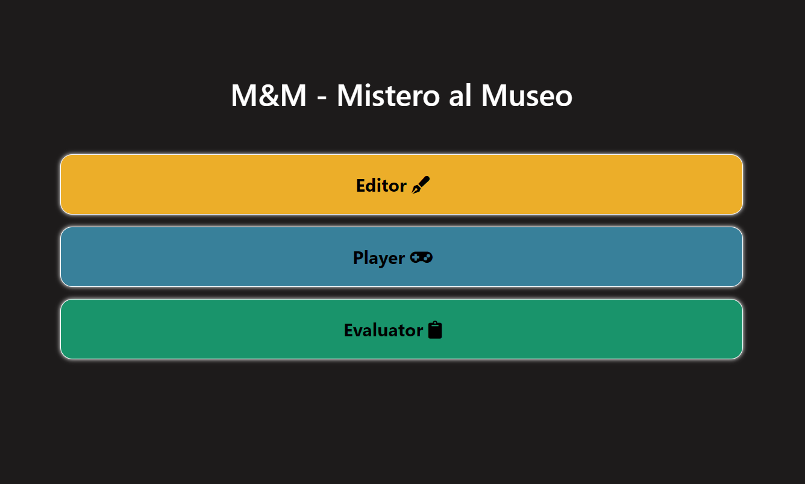

# M&M(Mistero al museo)
## Progetto per il corso di Tecnologie Web dell'università di Bologna,A.A.2019-2020.
\
Un'applicazione web inizialmente pensata per essere utilizzata nei musei, ma a seguito dell'emergenza sanitaria dovuta al COVID-19 la consegna è variata,sarà possibile utilizzare l'applicazione eventualmente da casa. L'intero progetto è stato scritto in Html, CSS, JavaScript, con l'ausilio dei framework: [Bootstrap 4.5](https://getbootstrap.com/docs/4.5/getting-started/download/), [VueJS](https://vuejs.org/) e [JQuery](https://jquery.com/). Per l'inserimento di alcune icone invece abbiamo utilizzato [Font Awesome](https://fontawesome.com/).

### OBIETTIVI
Lo scopo del progetto è quello di far imparare agli utenti(applicazione pensata per bambini e ragazzi delle scuole) determinati contenuti culturali e formativi, non facendo mancare però il divertimento, tramite il processo di [Gamification](https://it.wikipedia.org/wiki/Gamification). 

### DESCRIZIONE
Il progetto è diviso in 3 applicazioni web:
- il [Player](#player); 
- l'[Editor](#editor);
- il [Valutatore](#valutatore).

Un'immagine della homepage, dalla quale si può accedere a tutte le applicazioni. Cliccando su Player compariranno le storie attualmente pubbliche, e quindi giocabili.\
\

## Player
Questa è l'applicazione tramite la quale i ragazzi potranno leggere le storie pubblicate, scritte dal direttore del museo o dai genitori se devono essere giocate in casa.

E sottomettere risposte alle varie missioni per avanzare nella storia. Le attività presenti sono di 3 tipi: *scelta multipla, domanda aperta, figurativa e valutabile*. Per tutta la durata del gioco la schermata mostrerà il device scelto appositamente per l'ambientazione della storia, tramite il quale il giocatore compirà le azioni elencate in precedenza. Sono inoltre presenti un bottone per aprire una chat testuale real-time con lo staff del museo per chiedere chiarimenti in caso di difficoltà, e un altro per notificare semplicemente al valutatore la necessità di aiuto. 

## Editor
Questa applicazione web è invece dedicata interamente alla creazione, modifica e pubblicazione delle storie. È possibile creare una nuova storia da 0, modificare, copiare o cancellare una esistente, e creare il QR code per stamparlo e fare accedere al [Player](#player) i ragazzi tramite quello. Una storia è composta da molteplici missionni, a loro volta suddivise in attività. Si possono copiare, tagliare e cancellare le singole attività o intere missioni, e allo stesso tempo è possibile spostarle tra le varie storie. È necessario specificare per ogni attività in caso di risposta corretta e non quale sarà la prossima da svolgere, e per essere sicuri di arrivare sempre alla conclusione si può consultare il grafo dei percorsi che viene creato automaticamente.
Si può scegliere se la storia deve essere giocata da più gruppi diversi di ragazzi, e in quel caso è possibile specificare fino a 5 percorsi diversi, per evitare assembramenti e code in certe stanze.
È possibile aggiungere i widget che si preferiscono per le attività di tipo figurativo, semplicemente caricando nell'apposito form il css e il js.
Abbiamo implementato la possibilità di segnalare la storia come accessibile, ma è compito del valutatore scrivere attività ed eventualmente caricare widget accessibili.

## Valutatore
È l'applicazione di controllo della partita, divisa in 3 sezioni. Nella prima è possibile gestire le chat di tutti i giocatori attivi ed è presente un menù che notifica le richieste di aiuto e messaggi automatici quando i ragazzi sono da troppo tempo bloccati su un'attività. Nella sezione *Valuta* compaiono invece le richieste di valutazione delle attività valutabili, qui compaiono le schede con l'ora di invio, il nome dell'utente, la domanda posta al giocatore e la risposta inviata. Infine è presente la sezione delle *Impostazioni* nella quale è possibile cambiare il nome all'utente(comunicandolo al player), ma solo nei primi 15 secondi, perchè poi si è stimato che il player abbia già iniziato la storia; e la possibilità di verificare quali giocatori hanno terminato per poi stampare un JSON con i risultati della partita. 

Le applicazioni [Player](#player) e [Valutatore](#valutatore) sono studiate per essere utilizzabili sia dal pc che da uno smartphone.

## Server
Il server è scritto in [NodeJS](https://nodejs.org/it/) utilizzando in particolare Express e altri moduli installabili con npm e presenti nel file package-lock.json. È diviso in 3 moduli, uno per applicazione, gestiti come middleware dell'applicazione Express. Per riconoscere i diversi giocatori nella chat e gestire le loro richieste viene assegnato un cookie incrementale 'userId'. La chat real-time viene invece gestita da [Socket.io](https://socket.io/). 

## AUTORI
Contatti:
- https://github.com/erikalena
- https://github.com/DaniMoro
