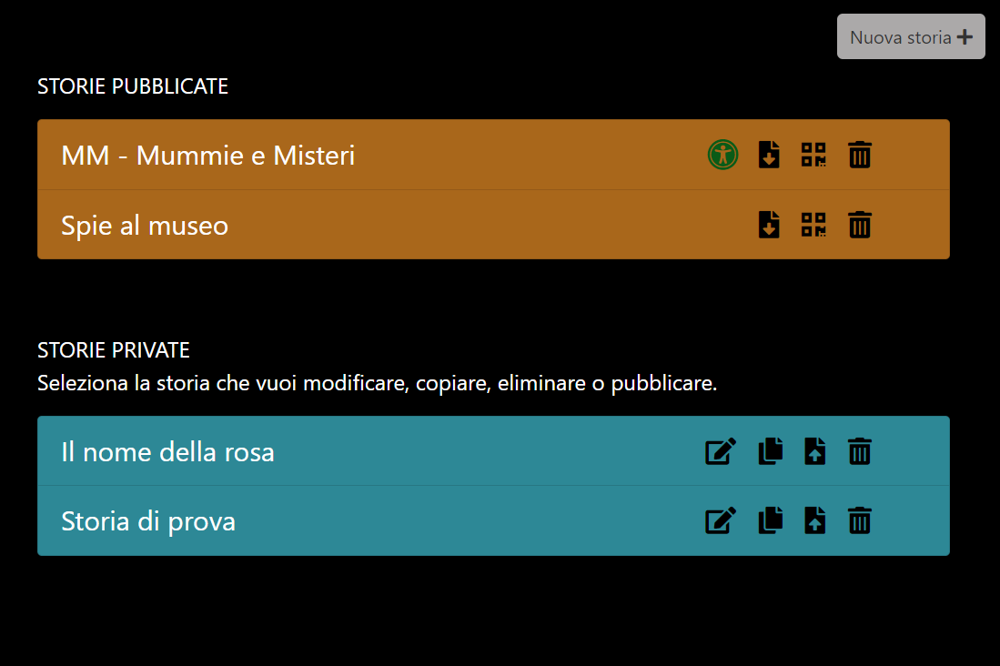
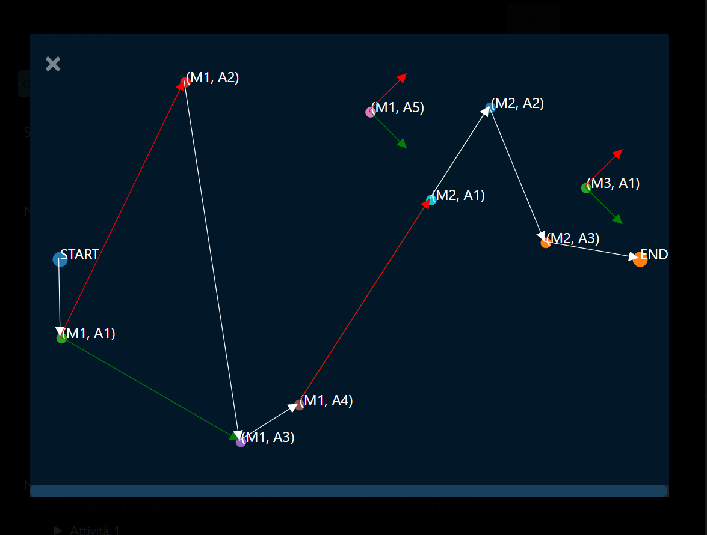
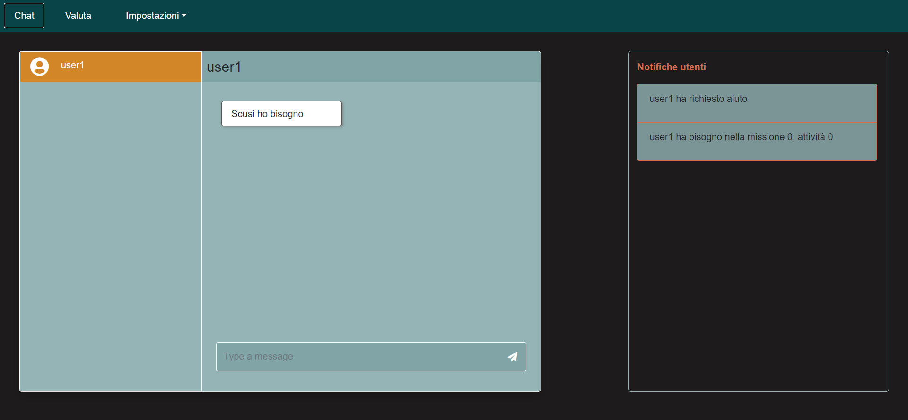

# MM - Mistery at the museum

### Table of Contents

- [Description](#description)
- [Usage](#usage)
- [Remarks](#remarks)
- [Server-side](#server)
- [Authors](#authors)

---
## Description
M&M is a web application which aims to build a software environment in which the user can write his own stories and make them playable by a classroom or kids at home. The evaluator role is played by teachers or parents depending on the circumstances as the stories can be adapted to a museum context as well as the domestic one. The aim of the project was to gamify the visit to a museum, this idea was then extended to the domestic context due to Covid-19 pandemic.
The application is structured in three main components:
 - [Editor](#editor): write the stories
 - [Player](#player): play the stories
 - [Evaluator](#evaluator): evaluate the activities 
 
 
 
## Usage

### Editor

The editor can be used by the museum curator or by kids’ parents to build up a story which can be played at the museum or at home respectively. Stories’ goal is to involve children and give them the opportunity to learn something by playing, for this reason each story is related to a specific age range. The editor must also specify if the story is created to be accessible. 
A story is composed of missions and each mission can be made of multiple activities; for each activity the editor must write the context and the challenge to be presented to the player. There are two particular kinds of activities: ‘evaluable’ and ‘figurative’, the former is to be evaluated by teachers or kids’ parents, the latter displays a widget which can be chosen by the editor. Two widgets are provided by the application and others can be created by the user. 
Once missions and activities have been created the user can specify a path to be followed by each group, at any time you can also visualize each path by opening his graph. Finally, you can add facilities and difficulties to be shown depending on whether the answer given is correct or not. 
Each story can be public or private, but only public stories can be played generating corresponding qrcode; on the other hand, stories can be modified only if they are in private space. Of course you can also edit, copy and delete your stories every time you want.


<table>
  <tr>
    <td width="50%"></td>
    <td width="50%"></td>
   </tr> 
   <tr>
      <td colspan="2"></td>
  </td>
  </tr>
</table>

 
 


### Player
 
Choose the story you want to play and start your mission, everything you need to know will be displayed on your device, so be careful and enjoy the game. The player is also equipped with a chat to communicate with the evaluator and a button to request help every time he needs it. 


### Evaluator
This application is used from the teacher or the parent who manages the game. It is composed by 3 components: Chat, Evaluate and Settings.

 - #### Chat 
   The chat component is meant for allowing the evaluator to communicate with the user if he needs it. There is also a section where requests for help are showing, so if users have some problems the evaluator can help them writing on the chat. 

 - #### Evaluate
 
   In this component the evaluator can see the requests arrived to be evaluated. The requests are presented as cards and when you click on the button a modal is opened and then you see the question, what the player has replied and you evaluate it.

 - #### Settings 
   Settings is divided into 2 sub-menu. In the first you can change the name of the players for the first 15 seconds. In the second it is possible to check which players have finished the game and print a JSON with the results. Furthermore, you can stop the game for every connected player and redirect all the player to a 404 page.

<table>
  <tr>
    <td width="50%"></td>
    <td width="50%"></td>
   </tr> 
   <tr>
      <td colspan="2"></td>
  </td>
  </tr>
</table>

## Remarks

### Responsiveness
The three components have been designed to be responsive so they can be used from different types of devices. This way the application can be easily played in every situation. For this purpose, we made use of [Boostrap 4.5 library](https://getbootstrap.com/docs/4.5/getting-started/introduction/) and media queries. 

### Accessibilty
The application has been tested using WAVE tool by [WebAIM](https://webaim.org/) to provide support to visual disabilities.

## Server
Server-side code has been written using [NodeJS](https://nodejs.org/it/) and Express, further packages has been installed with npm and they can be find in [package-lock.json](package-lock.json). You can install all of them using

```javascript

//go to your project directory and prompt the following command
npm install all

```
The code has been splitted in three modules to manage different requests made by the components of the application. We used cookies to identify users during the game and save data about them in order to allow the execution of some necessary server-side funcionalities. 
The chat has been written using [Socket.io](https://socket.io/) library. 

## Authors

This project has been developed as part of 'Web Technologies' course at the University of Bologna;<br>
all the code has been been written by: *Erika Lena*, *Daniele Morotti*.

Contact details:
- https://github.com/erikalena
- https://github.com/DaniMoro

Please let us know if you have any further questions or any kind of issues.

[Back To The Top](#mm---mistery-at-the-museum)
